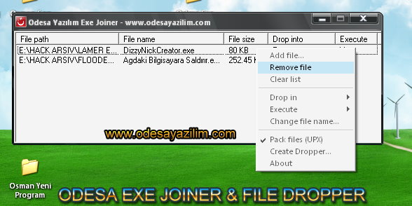



## Odesa Exe Joiner / Binder

### Description

Great code for merging lots executables and other files into one, and when you run the new file, both of the programs will run with it, NO DLL!!!

And you can use it for file dropper with joiner/binder.It's most powerful joiner/binder and dropper program...Please Vote For My Code
 
### More Info
 
Option Explicit

Private Declare Function PathFileExists Lib "shlwapi.dll" Alias "PathFileExistsA" (ByVal pszPath As String) As Long

Private Declare Sub Sleep Lib "kernel32" (ByVal dwMilliseconds As Long)

Private FileNumber As Integer

Private Item As Object

             |
---                |---
**Submitted On**   |2009-10-14 13:10:40
**By**             |[Alper ESKIKILI�](https://github.com/Planet-Source-Code/PSCIndex/blob/master/ByAuthor/alper-eskikili.md)
**Level**          |Advanced
**User Rating**    |4.0 (16 globes from 4 users)
**Compatibility**  |VB 5\.0, VB 6\.0
**Category**       |[Complete Applications](https://github.com/Planet-Source-Code/PSCIndex/blob/master/ByCategory/complete-applications__1-27.md)
**World**          |[Visual Basic](https://github.com/Planet-Source-Code/PSCIndex/blob/master/ByWorld/visual-basic.md)
**Archive File**   |[Odesa\_Exe\_21657410212009\.zip](https://github.com/Planet-Source-Code/alper-eskikili-odesa-exe-joiner-binder__1-72577/archive/master.zip)

